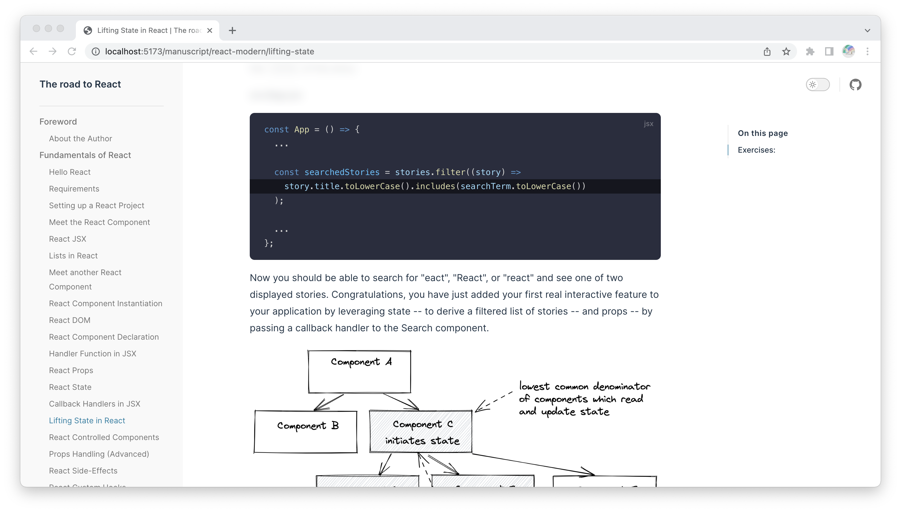

  

<h1 align="center">The Road to React online</h1>

The content of the book is forked from [The Road to React](https://github.com/the-road-to-learn-react/the-road-to-react/tree/master/manuscript).

> Extract the directory, support code highlighting, and pictures display for a better reading experience.

  

